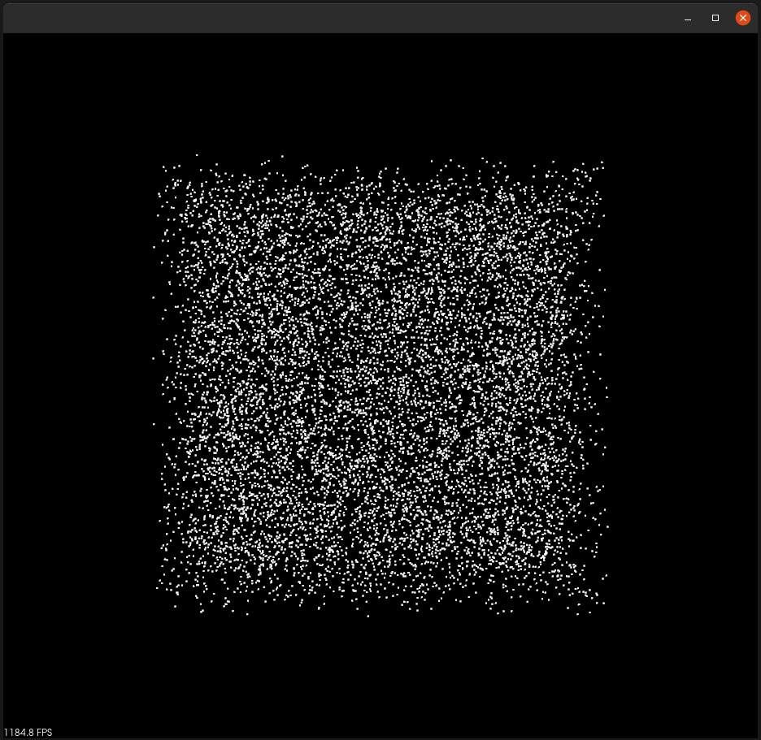

# pcl.py
[](https://travis-ci.com/cmpute/pcl.py)
[](https://pypi.org/project/pcl.py)
<!-- [](https://coveralls.io/github/cmpute/pcl.py) -->

Cython bindings of Point Cloud Library (PCL)

## Principles
Target for this library if to implement an **easy-to-use cython API** to the PCL (Point Cloud Library), combined with scipy and numpy. This library wraps `pcl::PCLPointCloud2` class into python (using [structured NumPy array](https://docs.scipy.org/doc/numpy/user/basics.rec.html)) and users can pass data from numpy to `PointCloud<PointT>` easily with this library and headers.

Nevertheless, this library focuses on simplicity, readability and accessibility, the heavily templatized part of original PCL is not implemented in this library due to the limitation of cython. However, the templated cython headers are added and you can still write this part of code in C++ and then wrap the input and output in python easily with this library.  

### Interface
The major classes in this library are `pcl.PointCloud`, `pcl.Visualizer`. Most methods from C++ library are directly wrapped into Python, while methods with `get` and `set` prefix are changed into Python object properties.

Since Cython doesn't support a template technique similar to ["covariant"](https://en.wikipedia.org/wiki/Covariance_and_contravariance_(computer_science)) in its template support, so the code which need this technique is not wrapped or header-provided as stated above.

### Advantage over [python-pcl](https://github.com/strawlab/python-pcl/) and [pclpy](https://github.com/davidcaron/pclpy/)
- PointCloud is stored in PCLPointCloud2 instead of PointCloud<PointT>. Thus the cloud can store various kind of point type
- Cython files are in the same structure as C++ library, which means the code you write in cython can be easily transferred to C++
- ROS support (convert from and to `sensor_msgs.msg.PointCloud2` type)
- Templated algorithms are implemented with most used point type, the other fields will be reserved.
- Using CMake to build extension, thus this library can be compiled upon different settings of PCL

------------------------

## Compatibility
- Written in Python 3 & Cython
- Requirements: Python 3.5, Numpy>=1.11, Cython>=0.29, scikit-build
- Tested on PCL 1.8.0 - 1.11.0, adding more compatibility is pending.

## Installation

- Installation from PyPI: `pip install pcl-py`
- Installation from source: `python setup.py install`
- Installation from source in-place: `python setup.py develop`

-------------------------

# Basic Usage

## Simple examples

```python
import pcl
import numpy as np

cloud = pcl.PointCloud([(1,2,3), (4,5,6)])
# <PointCloud of 2 points>

cloud.ptype
# 'XYZ'

array = cloud.to_ndarray()  # zero-copy!
# array([(1., 2., 3.), (4., 5., 6.)],
#       dtype={'names':['x','y','z'], 'formats':['<f4','<f4','<f4'], 'offsets':[0,4,8], 'itemsize':16})

cloud.xyz[0] = (3, 2, 1)  # access and modify coordinates by .xyz
cloud.xyz
# array([[3., 2., 1.],
#        [4., 5., 6.]], dtype=float32)

import pandas as pd
pd.DataFrame(cloud)
#                  0
# 0  [1.0, 2.0, 3.0]
# 1  [4.0, 5.0, 6.0]

pd.DataFrame(cloud.to_ndarray())
#      x    y    z
# 0  1.0  2.0  3.0
# 1  4.0  5.0  6.0

random_cloud = pcl.create_xyz(np.random.rand(10000, 3))
# <PointCloud of 10000 points>

from pcl.visualization import Visualizer, RenderingProperties
vis = Visualizer()  # create a point cloud visualizer and open a window
vis.addPointCloud(random_cloud, id="some_id")  # add the point cloud with a given identifier
vis.setPointCloudRenderingProperties(RenderingProperties.PointSize, 2, id="some_id")  # modify its rendering property
vis.spin()  # update the contents in the window and show the cloud
```

The final statement will show following window



**Please check [test codes](test/) for more usage examples and typing files (*.pyi files such as [PointCloud.pyi](pcl/PointCloud.pyi)) for the complete list of API.**

## Commonly-used APIs

- `pcl.PointCloud(data, point_type='XYZ')`: This class contains a pointer to a `pcl::PCLPointCloud2' object. The constructor of the PointCloud type has two arguments.
  - `data`: Can be a **list of tuples**, a **numpy array** (1-D or 2-D), a **ROS message** or another `PointCloud`. The shape of the data must comply with the given point type. If the data is a numpy array, it might need to be padded before passing to the constructor according to the point type, however padding is not required if a list of tuples is passed in.
  - `point_type`: The point type of the PointCloud, by default it's specified as `XYZ`, which represents `pcl::PointXYZ`. The point type can be either in the [supported type list](pcl/PointCloud.xyz#L110) or `CUSTOM`. If the point_type is custom, then the given data must be a structured numpy array, otherwise the input data should have the correct shape as defined by PCL. Use a builtin point type is required when interop with C++ libraries.

- `pcl.Visualizer()`: This class holds a pointer to a `pcl::visualization::PCLVisualizer' object. For the complete API list please refer to [the typing file](pcl/visualization/_visualization.pyi). Some commonly used methods are listed below.
  > Most methods follow the same API as the original PCL library. Note that for the methods that adds an object to the visualizer, there will always be a `id` parameter. You need to specify a unique id for each object, otherwise the object won't show on the screen and a PCL warning will be generated.
  - `createViewport(self, xmin, ymin, xmax, ymax)`: Create a subwindow (aka `viewport`) with window range (in ratio) on x and y axis of the screen and return the id of the viewport, which can be used to specify the viewport to be added to when using other methods
  - `addPointCloud(self, cloud, color=[1,1,1], field=None, color_handler=None, static_mapping=True, id="", viewport=0)`: Add a point cloud to the visualization. If color is given, then the points will be painted with the given color (color value ranges from 0 to 1). If field name is given, then the points will be painted according to the field value. If color_handler is given with a Python function (with a reference to the point cloud as input), then the returned array from the function will be used as the color values for each point. The default way to paint the point cloud depends on the fields.
  - `addLine(self, p1, p2, color=[1,1,1], id="")`: Add a 3D line segment from point `p1` to point `p2` with given color
  - `addArrow(self, p1, p2, line_color=[1,1,1], text_color=[1,1,1], display_length=False)`: Add a double-ended arrow between the point `p1` and `p2`. The arrow will always has a 1 pixel width. If `display_length` is `True`, then the measured length of the arrow will be displayed around the center of the arrow.
  - `spin(self)`: Start then rendering thread and the visualization will become interactive
  - `close(self)`: Dispose the resources of the visualizer.

- Some helper functions for creating the `pcl.PointCloud` objects
  - `pcl.create_xyz(data)`: Create a `pcl::PointXYZ` point cloud from a normal numpy array or list of values with shape N*3
  - `pcl.create_xyzi(data)`: Create a `pcl::PointXYZL` point cloud from a normal numpy array of list of values with shape N*4
  - `pcl.create_xyzrgb(data)`: Create a `pcl::PointXYZRGB` point cloud from a normal numpy array of list of values with shape N*6

- Some common functions to load and save point clouds:
  - `pcl.io.load_pcd(path)`: Load a point cloud from a PCD file with given path
  - `pcl.io.save_pcd(path, cloud, binary=False)`: Save `cloud` to a PCD file with given path. If `binary=True`, then the PCD file will be saved in binary format
  - `pcl.io.load_ply(path)`: Load a point cloud from a PLY file with given path
  - `pcl.io.save_pcd(path, cloud, binary=False, use_camera=False)`: Save `cloud` to a PLY file with given path. If `binary=True`, then the PLY file will be saved in binary format
  - `pcl.io.load_bin(path, point_type='xyz')`: Directly load the binary data saved in the given file to a PointCloud object. The point type need to be specified. This function can be helpful to load point cloud from some datasets (e.g. KITTI)
  - `pcl.io.save_bin(path)`: Directly dump the binary data stored in the PointCloud object to a binary file

## ROS integration

Use the integration with ROS is as simple as `cloud = pcl.PointCloud(msg)` and `msg = cloud.to_msg()`. To build the PointCloud from a message object, the message doesn't need to have the exact `sensor_msgs.msg.PointCloud2` type, rather it can have any type with proper fields defined. This is convenient when you receive messages from other machines and ROS sometimes will generate anonymous type to deserialized the data.

## Common incorrect usages
- `np.array(pcl.PointCloud([(1,2,3), (4,5,6)]))`: Directly convert to numpy array will return unstructured raw data, use `to_ndarray` instead for meaningful conversion.
- `pcl.PointCloud([[1,2,3], [4,5,6]])`: This expression will generate a PointCloud with 6 points. Only list of tuples are accepted for initialization, use `pcl.create_xyz` instead for more general initialization.
- `pcl.PointCloud(np.array([[1,2,3,4]]))`: This expression will generate a PointCloud with 1 point `(1,2,3)`, the last value will be shaded because `pcl::PointXYZ` type is aligned to 16 bytes. Please acknowledge the effect of this.
